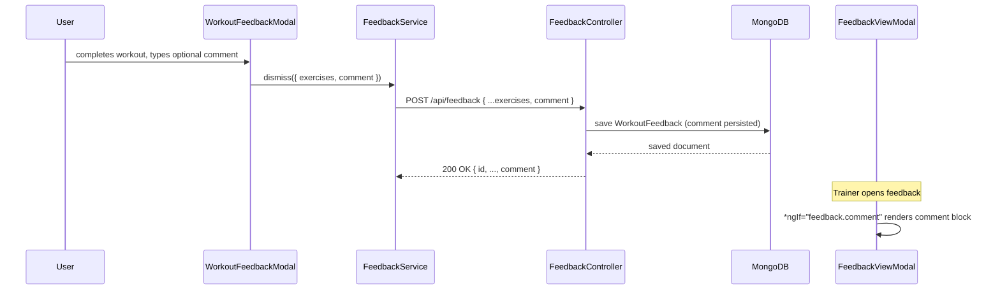

# Design Document: feedback-comment

## Overview

Add an optional free-text `comment` field to the workout feedback flow. The change touches three layers:

1. **Backend model** – `WorkoutFeedback.java` gains a nullable `comment` field; the existing `POST /api/feedback` endpoint persists it automatically via Spring Data deserialization.
2. **Frontend model** – The `WorkoutFeedback` TypeScript interface gains an optional `comment: string | null` field.
3. **Frontend UI** – `WorkoutFeedbackModal` adds a textarea for input; `FeedbackViewModal` conditionally renders the comment.

No new endpoints, services, or repositories are required. The change is intentionally minimal.

---

## Architecture



---

## Components and Interfaces

### Backend: `WorkoutFeedback.java`

Add a single nullable field:

```java
private String comment; // nullable – optional user note
// + getter/setter
```

No controller or repository changes are needed; Spring's `@RequestBody` deserialization handles the new field automatically.

### Frontend: `models.ts` – `WorkoutFeedback` interface

```typescript
export interface WorkoutFeedback {
  workoutId: string;
  workoutTitle?: string;
  userId: string;
  timestamp: number;
  exercises: ExerciseFeedback[];
  comment?: string | null;   // NEW
}
```

### Frontend: `WorkoutFeedbackModal`

- Add `comment: string | null = null` property.
- Add a `<textarea>` bound via `[(ngModel)]="comment"` below the exercise rows.
- Include the `comment` value in the object passed to `modalCtrl.dismiss()`.

### Frontend: `FeedbackViewModal`

- Add a conditional block below the exercise rows:

```html
<div *ngIf="feedback.comment" class="comment-section">
  <p class="comment-label">Comment</p>
  <p class="comment-text">{{ feedback.comment }}</p>
</div>
```

---

## Data Models

### MongoDB document (`workout_feedback` collection)

| Field          | Type     | Nullable | Notes                          |
|----------------|----------|----------|--------------------------------|
| `_id`          | ObjectId | no       | auto-generated                 |
| `workoutId`    | String   | no       |                                |
| `workoutTitle` | String   | yes      | snapshot at submission time    |
| `userId`       | String   | no       |                                |
| `timestamp`    | long     | no       | epoch ms                       |
| `exercises`    | Array    | no       |                                |
| `comment`      | String   | **yes**  | new field; null when omitted   |

Existing documents without `comment` will deserialize with `comment = null` — no migration needed.

---

## Correctness Properties

*A property is a characteristic or behavior that should hold true across all valid executions of a system — essentially, a formal statement about what the system should do. Properties serve as the bridge between human-readable specifications and machine-verifiable correctness guarantees.*

### Property 1: Comment persistence round-trip

*For any* `WorkoutFeedback` payload (where `comment` is any string value or null), submitting it via `POST /api/feedback` and then retrieving the saved document should return a `comment` field equal to the submitted value.

**Validates: Requirements 1.3, 1.4**

---

### Property 2: Comment textarea binding

*For any* string value (including empty string) entered into the comment textarea in `WorkoutFeedbackModal`, the payload passed to `modalCtrl.dismiss()` should have a `comment` field equal to that value (or `null` when the input is empty/whitespace-only).

**Validates: Requirements 2.3, 2.4**

---

### Property 3: Conditional comment rendering

*For any* `WorkoutFeedback` object, `FeedbackViewModal` should render the comment section if and only if `feedback.comment` is a non-empty string; for null or empty comment the section must be absent from the DOM.

**Validates: Requirements 3.1, 3.2**

---

## Error Handling

- **Oversized comment**: No explicit length limit is enforced at this stage. MongoDB stores strings up to 16 MB; the textarea has no `maxlength` constraint in this iteration.
- **Null safety on display**: The `*ngIf="feedback.comment"` guard in `FeedbackViewModal` handles both `null` and `undefined` without additional null checks.
- **Backward compatibility**: Existing `WorkoutFeedback` documents without a `comment` field deserialize cleanly to `null` in Java and `undefined`/`null` in TypeScript — no migration or fallback logic required.

---

## Testing Strategy

### Unit tests

Focus on specific examples and edge cases:

- `WorkoutFeedback.java`: verify that a document saved with a non-null comment is retrieved with the same comment; verify a document saved without a comment has `null`.
- `WorkoutFeedbackModal`: verify that `finish()` includes `comment` in the dismissed payload; verify that an empty textarea results in `null` or `''` in the payload.
- `FeedbackViewModal`: verify the comment block is present when `feedback.comment` is a non-empty string; verify it is absent when `feedback.comment` is `null` or `''`.

### Property-based tests

Use a property-based testing library (e.g., **fast-check** for TypeScript, **jqwik** for Java) with a minimum of **100 iterations per property**.

Each test must be tagged with a comment in the format:
`// Feature: feedback-comment, Property <N>: <property_text>`

**Property 1 – Comment persistence round-trip** (Java / Spring integration test with jqwik)
- Generator: arbitrary nullable strings for `comment`
- Action: POST feedback, retrieve by userId, find the saved document
- Assert: saved `comment` equals submitted `comment`
- Tag: `// Feature: feedback-comment, Property 1: comment persistence round-trip`

**Property 2 – Comment textarea binding** (TypeScript / fast-check)
- Generator: arbitrary strings including empty string
- Action: set component `comment` property, call `finish()`, capture dismissed value
- Assert: dismissed payload `comment` equals input (or null for empty/whitespace)
- Tag: `// Feature: feedback-comment, Property 2: comment textarea binding`

**Property 3 – Conditional comment rendering** (TypeScript / fast-check)
- Generator: arbitrary `WorkoutFeedback` objects with varying `comment` values (non-empty strings, empty string, null, undefined)
- Action: render `FeedbackViewModal` with the generated feedback
- Assert: comment section present iff `comment` is a non-empty string
- Tag: `// Feature: feedback-comment, Property 3: conditional comment rendering`
