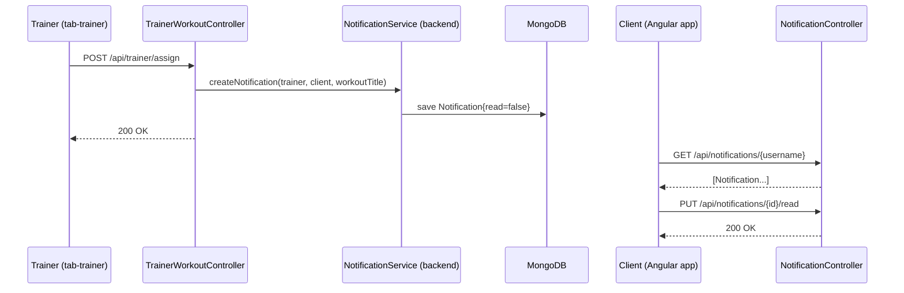
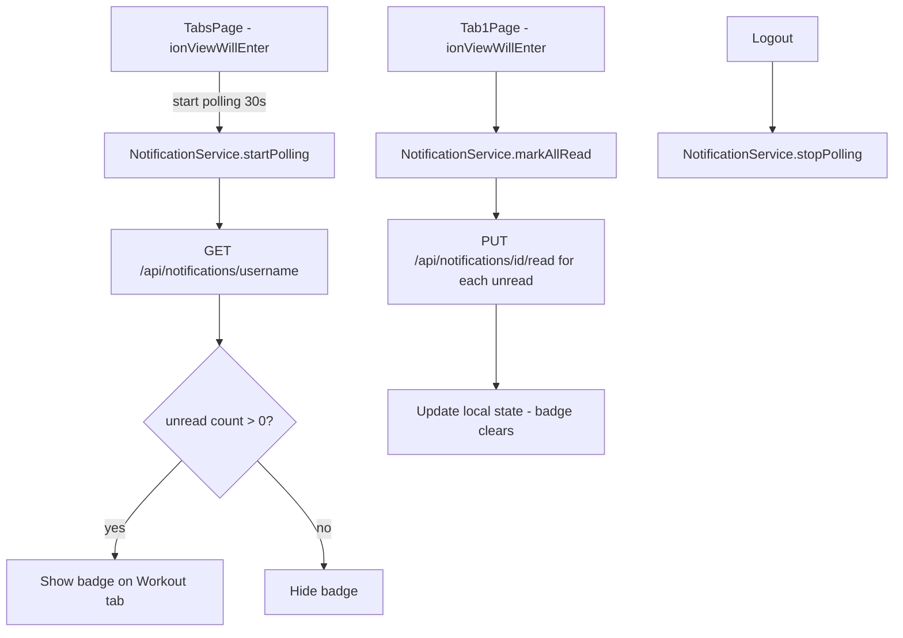

# Design Document: New Workout Notification

## Overview

This feature adds an in-app notification system to the Spite app. When a trainer assigns a workout to a client via `POST /api/trainer/assign`, the backend creates a `Notification` record. The Angular frontend polls for unread notifications every 30 seconds and displays a badge on the Workout tab. When the client opens the Workout tab, all unread notifications are marked as read and the badge clears.

Push notifications are out of scope. Only in-app notifications are covered.

The change touches two layers:
- **Backend**: new `Notification` model, `NotificationRepository`, `NotificationService`, and `NotificationController`; `TrainerWorkoutController.assignWorkout()` is updated to call `NotificationService` after a successful assignment.
- **Frontend**: new `NotificationService` Angular service with polling; `TabsPage` gains a badge on the Workout tab button; `Tab1Page` gains a notification list panel and marks notifications as read on entry.

---

## Architecture





---

## Components and Interfaces

### Backend

#### `Notification` (model)
MongoDB document in collection `notifications`.

#### `NotificationRepository` (repository)
Spring Data MongoDB repository for `Notification`.

Key query methods:
- `findByRecipientUsernameOrderByTimestampDesc(String recipientUsername)`
- `findByRecipientUsernameAndReadFalse(String recipientUsername)`

#### `NotificationService` (service)
Encapsulates notification creation and retrieval logic. Injected into `NotificationController` and `TrainerWorkoutController`.

Methods:
- `createNotification(trainerUsername, clientUsername, workoutTitle) → Notification`
- `getNotificationsForUser(username) → List<Notification>`
- `markAsRead(notificationId) → Notification`

#### `NotificationController` (REST controller)
Base path: `/api/notifications`

| Method | Path | Description |
|--------|------|-------------|
| GET | `/{username}` | Get all notifications for a user, ordered by timestamp desc |
| PUT | `/{id}/read` | Mark a notification as read |

#### `TrainerWorkoutController` changes
- After `linkRepo.save(link)` in `assignWorkout()`, call `notificationService.createNotification(trainer, client, workoutTitle)`.
- `NotificationService` is injected via constructor.

### Frontend

#### `NotificationService` (Angular service)
Singleton service (`providedIn: 'root'`) managing polling and notification state.

Properties:
- `notifications$: BehaviorSubject<AppNotification[]>` — current notification list
- `unreadCount$: Observable<number>` — derived from `notifications$`
- `hasUnread$: Observable<boolean>` — derived from `unreadCount$`

Methods:
- `startPolling(username: string): void` — begins 30-second interval polling
- `stopPolling(): void` — clears the interval
- `markAllRead(): void` — sends PUT for each unread notification, updates local state

#### `TabsPage` changes
- Inject `NotificationService`
- In `ionViewWillEnter`, call `notificationService.startPolling(username)` after reading user from localStorage
- In `ionViewWillLeave`, call `notificationService.stopPolling()`
- Bind `hasUnread$` to a badge element on the Workout tab button (mirrors the existing `hasUnreadMessages` pattern)

#### `Tab1Page` changes
- Inject `NotificationService`
- In `ionViewWillEnter`, call `notificationService.markAllRead()`
- Add a notification list panel bound to `notifications$` showing unread items with message and timestamp
- Show loading indicator while fetching; show empty-state message when no unread notifications

---

## Data Models

### Backend: `Notification`

```java
@Document(collection = "notifications")
public class Notification {
    @Id
    private String id;

    private String recipientUsername;
    private String message;
    private String type;          // e.g. "WORKOUT_ASSIGNED"
    private boolean read;
    private Instant timestamp;
}
```

### Frontend: `AppNotification` interface

```typescript
export interface AppNotification {
  id: string;
  recipientUsername: string;
  message: string;
  type: string;
  read: boolean;
  timestamp: string;  // ISO-8601 from backend
}
```

Added to `models.ts`.

---

## Correctness Properties

*A property is a characteristic or behavior that should hold true across all valid executions of a system — essentially, a formal statement about what the system should do. Properties serve as the bridge between human-readable specifications and machine-verifiable correctness guarantees.*

### Property 1: Workout assignment creates a notification

*For any* valid trainer-client-workout triple, after a successful `POST /api/trainer/assign`, exactly one `Notification` document SHALL exist in the database with `recipientUsername` equal to the client's username, `read` equal to `false`, and `type` equal to `WORKOUT_ASSIGNED`.

**Validates: Requirements 1.1, 1.3**

---

### Property 2: Duplicate assignment does not create a notification

*For any* trainer-client-workout triple where the assignment already exists (causing a 400 response), the count of `Notification` documents for that client SHALL remain unchanged.

**Validates: Requirements 1.2**

---

### Property 3: Notification retrieval returns all records ordered by timestamp

*For any* client username with N notification records, `GET /api/notifications/{username}` SHALL return exactly N records ordered by `timestamp` descending.

**Validates: Requirements 2.1**

---

### Property 4: Mark-as-read is idempotent

*For any* notification, calling `PUT /api/notifications/{id}/read` one or more times SHALL always result in `read = true` and HTTP 200, with no error on repeated calls.

**Validates: Requirements 3.1, 3.3**

---

### Property 5: Badge visibility matches unread count

*For any* notification list state, the badge on the Workout tab SHALL be visible if and only if the count of notifications where `read = false` is greater than zero.

**Validates: Requirements 4.1, 4.2**

---

### Property 6: Navigating to Workout tab marks all unread notifications as read

*For any* client with N unread notifications, after `ionViewWillEnter` fires on `Tab1Page`, all N notifications SHALL have `read = true` and the badge SHALL no longer be visible.

**Validates: Requirements 6.1, 6.2**

---

### Property 7: Notification list displays only unread notifications

*For any* notification list containing a mix of read and unread notifications, the Notification_List panel SHALL display only those where `read = false`, ordered by timestamp descending.

**Validates: Requirements 5.2**

---

## Error Handling

| Scenario | HTTP Status | Message |
|----------|-------------|---------|
| Username not found on GET | 404 | "User not found" |
| No notifications for user | 200 | `[]` (empty array) |
| Notification id not found on PUT | 404 | "Notification not found" |
| Internal error during notification creation | Logged server-side; assignment still succeeds | — |

Notification creation failures in `TrainerWorkoutController` are caught and logged but do not roll back the workout assignment, keeping the assignment flow resilient.

On the frontend, if a `PUT /api/notifications/{id}/read` call fails, `NotificationService` logs the error and continues marking remaining notifications (fire-and-continue pattern, per Requirement 6.3).

---

## Testing Strategy

### Unit / Integration Tests

Focus on specific examples and edge cases:
- `GET /api/notifications/{username}` returns 404 when user does not exist
- `GET /api/notifications/{username}` returns `[]` with HTTP 200 when no notifications exist
- `PUT /api/notifications/{id}/read` returns 404 for unknown id
- `PUT /api/notifications/{id}/read` on an already-read notification returns 200
- Assigning a workout that already exists does not create a notification
- `NotificationService.stopPolling()` clears the interval so no further HTTP calls are made

### Property-Based Tests

Use **jqwik** (Java) for backend property tests and **fast-check** (TypeScript) for frontend property tests. Each property test runs a minimum of 100 iterations.

Each test is tagged with a comment in the format:
`// Feature: new-workout-notification, Property {N}: {property_text}`

| Property | Test description |
|----------|-----------------|
| P1 | For any valid trainer-client-workout triple, successful assign creates exactly one unread WORKOUT_ASSIGNED notification |
| P2 | For any duplicate assignment (400 response), notification count is unchanged |
| P3 | For any client with N notifications, GET returns N records ordered by timestamp desc |
| P4 | For any notification, PUT /read called 1+ times always returns 200 and read=true |
| P5 | For any notification list, badge visible iff unread count > 0 |
| P6 | For any client with N unread notifications, Tab1 entry marks all as read and clears badge |
| P7 | For any mixed read/unread list, notification panel shows only unread items in timestamp desc order |
