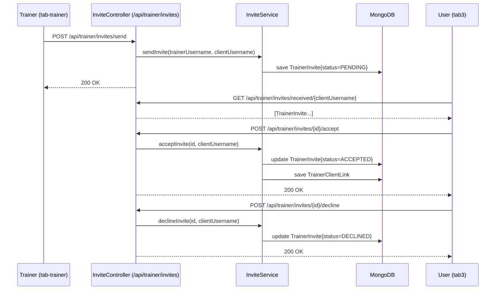

# Design Document: Trainer-Client Invite

## Overview

This feature replaces the direct trainer-add-client flow with a consent-based invite system. A trainer sends an invite to a user by username; the user sees pending invites and can accept or decline. Only on acceptance is a `TrainerClientLink` created. The existing `POST /api/trainer/add-client` endpoint is removed.

The change touches three layers:
- **Backend**: new `TrainerInvite` model, `TrainerInviteRepository`, `InviteService`, and `InviteController`; removal of `add-client` from `TrainerController`
- **Frontend (trainer)**: `tab-trainer` page replaces "Add Client" with "Send Invite" and shows pending sent invites with cancel option
- **Frontend (user)**: `tab3` page gains a "Pending Invites" section with Accept/Decline buttons

---

## Architecture



---

## Components and Interfaces

### Backend

#### `TrainerInvite` (model)
MongoDB document in collection `trainer_invites`.

#### `TrainerInviteRepository` (repository)
Spring Data MongoDB repository for `TrainerInvite`.

Key query methods:
- `findByTrainerUsernameAndStatus(String trainerUsername, InviteStatus status)`
- `findByClientUsernameAndStatus(String clientUsername, InviteStatus status)`
- `existsByTrainerUsernameAndClientUsernameAndStatus(String, String, InviteStatus)`

#### `InviteService` (service)
Encapsulates all invite business logic. Injected into `InviteController`.

Methods:
- `sendInvite(trainerUsername, clientUsername) → TrainerInvite`
- `getSentInvites(trainerUsername) → List<TrainerInvite>`
- `cancelInvite(inviteId, trainerUsername) → void`
- `getReceivedInvites(clientUsername) → List<TrainerInvite>`
- `acceptInvite(inviteId, clientUsername) → void`
- `declineInvite(inviteId, clientUsername) → void`

#### `InviteController` (REST controller)
Base path: `/api/trainer/invites`

| Method | Path | Description |
|--------|------|-------------|
| POST | `/send` | Send invite (trainer) |
| GET | `/sent/{trainerUsername}` | Get pending sent invites |
| DELETE | `/{id}/cancel` | Cancel a pending invite |
| GET | `/received/{clientUsername}` | Get pending received invites |
| POST | `/{id}/accept` | Accept an invite |
| POST | `/{id}/decline` | Decline an invite |

#### `TrainerController` changes
- Remove `POST /api/trainer/add-client` method entirely.

### Frontend

#### `tab-trainer.page.ts/html`
- Remove `addClient()` method and "Add Client" button
- Add `sendInvite()` method calling `POST /api/trainer/invites/send`
- Add `pendingInvites: TrainerInvite[]` array loaded on `ionViewWillEnter`
- Add `cancelInvite(id)` method calling `DELETE /api/trainer/invites/{id}/cancel`
- Display pending sent invites list with cancel button per row

#### `tab3.page.ts/html`
- Add `pendingInvites: TrainerInvite[]` array
- Load received invites via `GET /api/trainer/invites/received/{username}` in `loadData()`
- Add `acceptInvite(id)` and `declineInvite(id)` methods
- Display pending invites section with Accept/Decline buttons

---

## Data Models

### `TrainerInvite`

```java
@Document(collection = "trainer_invites")
public class TrainerInvite {
    @Id
    private String id;

    private String trainerUsername;
    private String clientUsername;
    private InviteStatus status;   // PENDING | ACCEPTED | DECLINED
    private Instant createdAt;
}
```

### `InviteStatus` (enum)

```java
public enum InviteStatus {
    PENDING,
    ACCEPTED,
    DECLINED
}
```

### Frontend model (`TrainerInvite` interface)

```typescript
export interface TrainerInvite {
  id: string;
  trainerUsername: string;
  clientUsername: string;
  status: 'PENDING' | 'ACCEPTED' | 'DECLINED';
  createdAt: string;
}
```

---

## Correctness Properties

*A property is a characteristic or behavior that should hold true across all valid executions of a system — essentially, a formal statement about what the system should do. Properties serve as the bridge between human-readable specifications and machine-verifiable correctness guarantees.*

### Property 1: Sent invite has PENDING status

*For any* valid trainer and existing client username, when the trainer sends an invite, the resulting `TrainerInvite` document stored in the database SHALL have status `PENDING`.

**Validates: Requirements 1.1**

---

### Property 2: Non-trainer cannot send invite

*For any* user without `Role.TRAINER`, attempting to send an invite SHALL result in HTTP 403.

**Validates: Requirements 1.2**

---

### Property 3: Duplicate invite is rejected

*For any* trainer-client pair where a `PENDING` invite already exists, sending a second invite SHALL return HTTP 400 with the message "Invite already sent".

**Validates: Requirements 1.4**

---

### Property 4: Sending an invite does not create a TrainerClientLink

*For any* invite send operation, the count of `TrainerClientLink` documents in the database SHALL remain unchanged.

**Validates: Requirements 1.6**

---

### Property 5: Sent invites query returns only PENDING for that trainer

*For any* trainer with a mix of PENDING, ACCEPTED, and DECLINED invites, the `GET /sent/{trainerUsername}` endpoint SHALL return only documents where `trainerUsername` matches and `status` is `PENDING`.

**Validates: Requirements 2.1**

---

### Property 6: Received invites query returns only PENDING for that user

*For any* user with a mix of invite statuses across multiple trainers, the `GET /received/{clientUsername}` endpoint SHALL return only documents where `clientUsername` matches and `status` is `PENDING`.

**Validates: Requirements 4.1**

---

### Property 7: Cancelling a pending invite removes it

*For any* existing `PENDING` invite, after the owning trainer cancels it, the invite document SHALL no longer exist in the database.

**Validates: Requirements 3.1**

---

### Property 8: State-change actions on non-PENDING invites are rejected

*For any* invite whose status is `ACCEPTED` or `DECLINED`, any state-change action (accept, decline, or cancel) SHALL return HTTP 400 with the appropriate "no longer pending" or "only pending invites can be cancelled" message.

**Validates: Requirements 3.3, 5.4, 6.4, 8.1**

---

### Property 9: Accepting an invite creates exactly one TrainerClientLink

*For any* `PENDING` invite, after the client accepts it, exactly one `TrainerClientLink` SHALL exist between that trainer and client, and the invite status SHALL be `ACCEPTED`.

**Validates: Requirements 5.1, 5.2, 8.2**

---

### Property 10: Declining an invite does not create a TrainerClientLink

*For any* `PENDING` invite, after the client declines it, the count of `TrainerClientLink` documents between that trainer and client SHALL remain zero, and the invite status SHALL be `DECLINED`.

**Validates: Requirements 6.1, 6.2**

---

### Property 11: Removing a TrainerClientLink does not delete the TrainerInvite

*For any* accepted invite where a `TrainerClientLink` exists, after the link is deleted, the corresponding `TrainerInvite` document SHALL still exist in the database with status `ACCEPTED`.

**Validates: Requirements 8.3**

---

## Error Handling

| Scenario | HTTP Status | Message |
|----------|-------------|---------|
| Sender is not a TRAINER | 403 | "Access denied: only trainers can send invites." |
| Target user does not exist | 400 | "User not found" |
| PENDING invite already exists | 400 | "Invite already sent" |
| Target is already a client | 400 | "User is already your client" |
| Invite not found or wrong owner | 404 | "Invite not found" |
| Invite is not PENDING (accept/decline) | 400 | "Invite is no longer pending" |
| Invite is not PENDING (cancel) | 400 | "Only pending invites can be cancelled" |

All error responses use `ResponseEntity<String>` with the message as the body, consistent with the existing `TrainerController` pattern.

---

## Testing Strategy

### Unit / Integration Tests

Focus on specific examples and edge cases:
- Sending an invite with a non-existent client username returns 400
- Sending an invite when a `TrainerClientLink` already exists returns 400
- Cancelling an invite that belongs to a different trainer returns 404
- Accepting an invite with a mismatched `clientUsername` returns 404
- Removing a `TrainerClientLink` leaves the `TrainerInvite` intact

### Property-Based Tests

Use **jqwik** (Java) for backend property tests and **fast-check** (TypeScript) for frontend property tests. Each property test runs a minimum of 100 iterations.

Each test is tagged with a comment in the format:
`// Feature: trainer-client-invite, Property {N}: {property_text}`

| Property | Test description |
|----------|-----------------|
| P1 | For any valid trainer+client pair, sent invite has PENDING status |
| P2 | For any non-trainer user, send invite returns 403 |
| P3 | For any duplicate trainer+client pair, second send returns 400 "Invite already sent" |
| P4 | For any invite send, TrainerClientLink count is unchanged |
| P5 | For any trainer with mixed-status invites, GET /sent returns only PENDING |
| P6 | For any user with mixed-status invites, GET /received returns only PENDING |
| P7 | For any PENDING invite, cancel removes the document |
| P8 | For any non-PENDING invite, state-change actions return 400 |
| P9 | For any PENDING invite, accept creates exactly one TrainerClientLink and sets ACCEPTED |
| P10 | For any PENDING invite, decline creates no TrainerClientLink and sets DECLINED |
| P11 | For any accepted invite, removing the link leaves the invite document intact |
