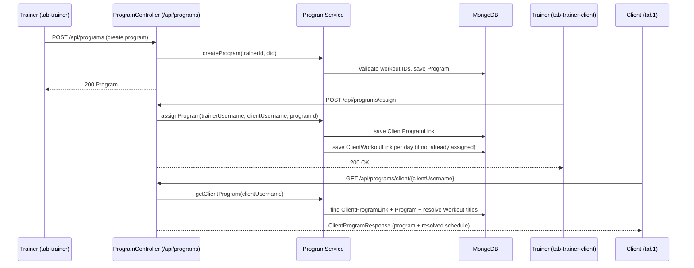

# Design Document: Trainer Program

## Overview

This feature adds reusable weekly training programs to the existing trainer/client workout system. A trainer creates a `Program` — a named plan that maps days of the week to specific workouts. The trainer can assign an entire program to a client in one action, which automatically creates `ClientWorkoutLink` records for each day's workout. Clients see a weekly schedule view in `tab1`. Trainers manage programs in `tab-trainer` and assign them from `tab-trainer-client`.

The feature adds two new domain entities (`Program`, `ClientProgramLink`) and extends three existing frontend pages (`tab-trainer`, `tab-trainer-client`, `tab1`).

---

## Architecture



---

## Components and Interfaces

### Backend

#### `Program` (model)
MongoDB document in collection `programs`.

#### `ClientProgramLink` (model)
MongoDB document in collection `client_program_links`.

#### `ProgramRepository` (repository)
Spring Data MongoDB repository for `Program`.

Key query methods:
- `findByTrainerId(String trainerId)`
- `findById(String id)`

#### `ClientProgramLinkRepository` (repository)
Spring Data MongoDB repository for `ClientProgramLink`.

Key query methods:
- `findByClientUsername(String clientUsername)`
- `findByClientUsernameAndProgramId(String clientUsername, String programId)`
- `existsByClientUsernameAndProgramId(String clientUsername, String programId)`
- `findByProgramId(String programId)`

#### `ProgramService` (service)
Encapsulates all program business logic.

Methods:
- `createProgram(trainerId, dto) → Program`
- `getTrainerPrograms(trainerId) → List<Program>`
- `updateProgram(programId, trainerId, dto) → Program`
- `deleteProgram(programId, trainerId) → void`
- `assignProgram(trainerUsername, clientUsername, programId) → void`
- `unassignProgram(clientUsername, programId) → void`
- `getClientProgram(clientUsername) → ClientProgramResponse`
- `getClientsWithPrograms(trainerUsername) → List<ClientProgramSummary>`

#### `ProgramController` (REST controller)
Base path: `/api/programs`

| Method | Path | Description |
|--------|------|-------------|
| POST | `/` | Create program (trainer) |
| GET | `/trainer/{trainerId}` | Get trainer's programs |
| PUT | `/{programId}` | Update program |
| DELETE | `/{programId}?trainerId=` | Delete program + all ClientProgramLinks |
| POST | `/assign` | Assign program to client |
| DELETE | `/unassign?clientUsername=&programId=` | Unassign program from client |
| GET | `/client/{clientUsername}` | Get client's assigned program (with resolved schedule) |
| GET | `/trainer/{trainerUsername}/clients-with-programs` | Get clients with program assignments |

### Frontend

#### `tab-trainer.page.ts/html`
- Add `programs: Program[]` array loaded on `ionViewWillEnter`
- Add `loadPrograms()` calling `GET /api/programs/trainer/{trainerId}`
- Add `createProgram()` opening a modal/alert form for title, description, and day-by-day workout selector
- Add `deleteProgram(programId)` with confirmation prompt
- Display programs list with delete button per row

#### `tab-trainer-client.page.ts/html`
- Add new segment tab "Programs"
- Add `trainerPrograms: Program[]` and `clientProgram: ClientProgramResponse | null`
- Add `loadPrograms()` and `loadClientProgram()`
- Add `assignProgram(programId)` calling `POST /api/programs/assign`
- Add `unassignProgram()` with confirmation prompt calling `DELETE /api/programs/unassign`

#### `tab1.page.ts/html`
- Add `clientProgram: ClientProgramResponse | null`
- Load client program via `GET /api/programs/client/{username}` in `ionViewWillEnter`
- Display weekly schedule section when a program is assigned
- Each day row shows day name + workout title (or "Rest")
- Tapping a workout navigates to its detail view

---

## Data Models

### `Program` (Java)

```java
@Document(collection = "programs")
public class Program {
    @Id
    private String id;

    private String trainerId;
    private String title;
    private String description;
    // Map from DayOfWeek name (e.g. "MONDAY") to workoutId
    private Map<String, String> weeklySchedule;
}
```

### `ClientProgramLink` (Java)

```java
@Document(collection = "client_program_links")
public class ClientProgramLink {
    @Id
    private String id;

    private String clientUsername;
    private String programId;
    private String assignedBy;   // trainer username
    private Instant assignedAt;
}
```

### `ProgramDto` (request body)

```java
public class ProgramDto {
    private String title;
    private String description;
    private Map<String, String> weeklySchedule; // DayOfWeek -> workoutId
}
```

### `ClientProgramResponse` (response DTO)

```java
public class ClientProgramResponse {
    private String programId;
    private String programTitle;
    private String programDescription;
    // Map from DayOfWeek name to workout title (or null for rest days)
    private Map<String, String> resolvedSchedule;
}
```

### `ClientProgramSummary` (response DTO)

```java
public class ClientProgramSummary {
    private String clientUsername;
    private String programId;    // null if no program assigned
    private String programTitle; // null if no program assigned
}
```

### Frontend models (TypeScript)

```typescript
export interface Program {
  id?: string;
  trainerId: string;
  title: string;
  description: string;
  weeklySchedule: { [day: string]: string }; // DayOfWeek -> workoutId
}

export interface ClientProgramResponse {
  programId: string;
  programTitle: string;
  programDescription: string;
  resolvedSchedule: { [day: string]: string | null }; // DayOfWeek -> workout title or null
}
```

---

## Correctness Properties

*A property is a characteristic or behavior that should hold true across all valid executions of a system — essentially, a formal statement about what the system should do. Properties serve as the bridge between human-readable specifications and machine-verifiable correctness guarantees.*

### Property 1: Created program is owned by the trainer

*For any* valid trainer ID and program creation request with a non-empty title and at least one WeeklySchedule entry, the persisted `Program` document SHALL have `trainerId` equal to the requesting trainer's ID.

**Validates: Requirements 1.1, 1.4**

---

### Property 2: Program creation with missing title is rejected

*For any* program creation request where the title is null or blank, the Program_API SHALL return HTTP 400.

**Validates: Requirements 1.2**

---

### Property 3: Program creation with invalid workout ID is rejected

*For any* program creation request containing a WeeklySchedule entry whose workout ID does not exist in the database, the Program_API SHALL return HTTP 400.

**Validates: Requirements 1.3**

---

### Property 4: Trainer only sees their own programs

*For any* trainer, the `GET /api/programs/trainer/{trainerId}` endpoint SHALL return only `Program` documents where `trainerId` matches that trainer's ID.

**Validates: Requirements 2.1**

---

### Property 5: Update or delete by non-owner is rejected

*For any* program owned by trainer A, any update or delete request made with a different trainer's ID SHALL return HTTP 403.

**Validates: Requirements 2.3**

---

### Property 6: Deleting a program removes all its ClientProgramLinks

*For any* program that has been assigned to one or more clients, after the program is deleted, no `ClientProgramLink` documents referencing that program ID SHALL exist in the database.

**Validates: Requirements 2.4**

---

### Property 7: Assigning a program creates a ClientProgramLink

*For any* valid trainer, client, and program, after assignment, exactly one `ClientProgramLink` SHALL exist with the matching `clientUsername` and `programId`.

**Validates: Requirements 3.1**

---

### Property 8: Assigning a program creates ClientWorkoutLinks for unassigned workouts

*For any* program assignment where the program's WeeklySchedule contains N distinct workout IDs and the client already has M of those workouts assigned, the assignment SHALL create exactly N − M new `ClientWorkoutLink` records for that client.

**Validates: Requirements 3.2**

---

### Property 9: Duplicate program assignment is rejected

*For any* client-program pair where a `ClientProgramLink` already exists, a second assignment request SHALL return HTTP 400 with the message "Program already assigned to this client".

**Validates: Requirements 3.3**

---

### Property 10: Unassigning a program removes only non-shared workout links

*For any* program unassignment, the `ClientWorkoutLink` records for workouts that appear exclusively in the unassigned program SHALL be deleted, while links for workouts shared with another assigned program SHALL remain.

**Validates: Requirements 4.2**

---

### Property 11: Client program response resolves all workout titles

*For any* client with an assigned program, the `GET /api/programs/client/{clientUsername}` response SHALL contain a `resolvedSchedule` where every entry with a non-null workout ID maps to the corresponding workout's title.

**Validates: Requirements 5.3**

---

## Error Handling

| Scenario | HTTP Status | Message |
|----------|-------------|---------|
| Program title is missing | 400 | "Title is required" |
| WeeklySchedule references non-existent workout | 400 | "Workout not found: {workoutId}" |
| Update/delete by non-owner | 403 | "Access denied: you do not own this program" |
| Program not found | 404 | "Program not found" |
| Client not found | 404 | "Client not found" |
| Program already assigned to client | 400 | "Program already assigned to this client" |
| ClientProgramLink not found on unassign | 404 | "Assignment not found" |

All error responses use `ResponseEntity<String>` consistent with the existing `TrainerWorkoutController` pattern.

---

## Testing Strategy

### Unit / Integration Tests

Focus on specific examples and edge cases:
- Creating a program with an empty title returns 400
- Creating a program with a non-existent workout ID returns 400
- Updating a program owned by a different trainer returns 403
- Deleting a program removes all associated `ClientProgramLink` records
- Assigning a program that is already assigned returns 400
- Unassigning a program only removes workout links not shared with another program
- Client with no program assigned receives empty/null response

### Property-Based Tests

Use **jqwik** (Java) for backend property tests and **fast-check** (TypeScript) for frontend property tests. Each property test runs a minimum of 100 iterations.

Each test is tagged with a comment in the format:
`// Feature: trainer-program, Property {N}: {property_text}`

| Property | Test description |
|----------|-----------------|
| P1 | For any valid trainer + program request, created program has correct trainerId |
| P2 | For any program request with blank title, API returns 400 |
| P3 | For any program request with invalid workout ID, API returns 400 |
| P4 | For any trainer, GET /trainer/{id} returns only that trainer's programs |
| P5 | For any program, update/delete by non-owner returns 403 |
| P6 | For any deleted program, no ClientProgramLinks for that programId remain |
| P7 | For any valid assignment, exactly one ClientProgramLink exists |
| P8 | For any assignment, new ClientWorkoutLinks = unassigned workouts in schedule |
| P9 | For any duplicate assignment, API returns 400 "Program already assigned to this client" |
| P10 | For any unassignment, only non-shared workout links are removed |
| P11 | For any client with assigned program, resolvedSchedule maps all workout IDs to titles |
