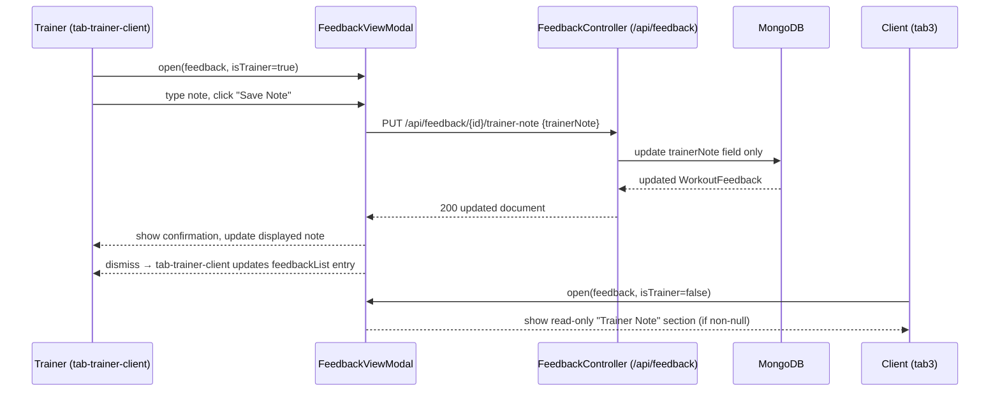

# Design Document: Trainer Workout Message

## Overview

This feature adds a `trainerNote` field to the `WorkoutFeedback` document, allowing trainers to attach a targeted text note to any specific client workout session. The note is written and saved from the existing `FeedbackViewModal` (opened in trainer context from `tab-trainer-client`), and displayed read-only to the client when they review the same entry.

The change touches three layers:
- **Backend**: add `trainerNote` field to `WorkoutFeedback` model; add `PUT /api/feedback/{id}/trainer-note` endpoint in `FeedbackController`
- **Frontend (modal)**: extend `FeedbackViewModal` with an `isTrainer` input flag; show editable textarea for trainers, read-only note section for clients
- **Frontend (pages)**: pass `isTrainer: true` from `tab-trainer-client`; add workout history section to `tab3` that opens the modal with `isTrainer: false`; sync local `feedbackList` after a note is saved

---

## Architecture



---

## Components and Interfaces

### Backend

#### `WorkoutFeedback` (model change)
Add a nullable `trainerNote` field of type `String`. No migration needed — MongoDB documents without the field will deserialize with `null`.

#### `FeedbackController` (endpoint addition)
Add a new `PUT /api/feedback/{id}/trainer-note` method.

| Method | Path | Body | Response |
|--------|------|------|----------|
| PUT | `/api/feedback/{id}/trainer-note` | `{ "trainerNote": "..." }` | 200 updated `WorkoutFeedback` / 404 |

The handler:
1. Looks up the document by `id`; returns 404 if not found
2. Sets `trainerNote` to `null` if the body value is an empty string, otherwise sets it to the provided value
3. Saves and returns the updated document

#### `TrainerNoteRequest` (DTO)
A simple request body class with a single `String trainerNote` field, used to deserialize the PUT body.

### Frontend

#### `FeedbackViewModal` (extended)
New inputs:
- `@Input() isTrainer: boolean` — controls which UI sections are rendered

Trainer mode (`isTrainer = true`):
- Editable `<textarea>` pre-populated with `feedback.trainerNote` (empty if null)
- "Save Note" button that calls `PUT /api/feedback/{id}/trainer-note`
- On success: update `feedback.trainerNote` in-component, emit updated feedback via `ModalController.dismiss(updatedFeedback)`, show toast confirmation
- On error: show error message, retain textarea content

Client mode (`isTrainer = false`):
- Read-only section labelled "Trainer Note" rendered only when `feedback.trainerNote` is non-null and non-empty
- No edit controls rendered

New dependencies: `HttpClient`, `IonTextarea`, `IonToast` (or `ToastController`), `FormsModule`

#### `tab-trainer-client.page.ts` (change)
- Pass `isTrainer: true` in `componentProps` when calling `modalCtrl.create` for `FeedbackViewModal`
- After `modal.onDidDismiss()`, if the returned data contains an updated feedback object, find the matching entry in `feedbackList` by `id` and replace it in-place

#### `tab3.page.ts` (change)
- Add `feedbackList: WorkoutFeedback[]` array
- Add `loadFeedback()` method calling `GET /api/feedback/user/{username}`
- Call `loadFeedback()` inside `loadData()`
- Add `openFeedback(fb)` method that opens `FeedbackViewModal` with `isTrainer: false`
- Import `FeedbackViewModal` and add `ModalController` provider

#### `tab3.page.html` (change)
- Add a "Workout History" section listing `feedbackList` entries
- Each entry shows workout title and date, tappable to open `FeedbackViewModal`

---

## Data Models

### Backend: `WorkoutFeedback` (updated)

```java
@Document(collection = "workout_feedback")
public class WorkoutFeedback {
    @Id
    private String id;

    private String workoutId;
    private String workoutTitle;
    private String userId;
    private long timestamp;
    private List<ExerciseFeedback> exercises;
    private String trainerNote;   // NEW — nullable

    // getters/setters ...
    public String getTrainerNote() { return trainerNote; }
    public void setTrainerNote(String trainerNote) { this.trainerNote = trainerNote; }
}
```

### Backend: `TrainerNoteRequest` (new DTO)

```java
public class TrainerNoteRequest {
    private String trainerNote;
    public String getTrainerNote() { return trainerNote; }
    public void setTrainerNote(String trainerNote) { this.trainerNote = trainerNote; }
}
```

### Frontend: `WorkoutFeedback` interface (updated)

```typescript
export interface WorkoutFeedback {
  id?: string;           // NEW — needed to call the PUT endpoint
  workoutId: string;
  workoutTitle?: string;
  userId: string;
  timestamp: number;
  exercises: ExerciseFeedback[];
  trainerNote?: string | null;  // NEW
}
```

---

## Correctness Properties

*A property is a characteristic or behavior that should hold true across all valid executions of a system — essentially, a formal statement about what the system should do. Properties serve as the bridge between human-readable specifications and machine-verifiable correctness guarantees.*

### Property 1: GET feedback always includes trainerNote field

*For any* user with any number of `WorkoutFeedback` documents, the `GET /api/feedback/user/{userId}` response SHALL include a `trainerNote` field on every returned object (the value may be `null`).

**Validates: Requirements 1.3**

---

### Property 2: PUT trainer-note updates only trainerNote

*For any* existing `WorkoutFeedback` document and any non-empty note string, calling `PUT /api/feedback/{id}/trainer-note` SHALL update the `trainerNote` field to the provided value and leave all other fields (workoutId, userId, timestamp, exercises, etc.) unchanged.

**Validates: Requirements 2.2**

---

### Property 3: Empty string trainerNote is stored as null

*For any* existing `WorkoutFeedback` document, calling `PUT /api/feedback/{id}/trainer-note` with an empty string SHALL result in the `trainerNote` field being `null` in the stored document.

**Validates: Requirements 2.4**

---

### Property 4: isTrainer flag controls edit vs. read-only rendering

*For any* `WorkoutFeedback` object, when `FeedbackViewModal` is rendered with `isTrainer = true` the editable textarea and "Save Note" button SHALL be present; when rendered with `isTrainer = false` those controls SHALL NOT be present.

**Validates: Requirements 3.1, 5.4**

---

### Property 5: Textarea value reflects trainerNote

*For any* `WorkoutFeedback` object opened in trainer mode, the textarea value SHALL equal `feedback.trainerNote` (empty string when `trainerNote` is null).

**Validates: Requirements 3.2, 3.3**

---

### Property 6: Save Note triggers PUT with current textarea value

*For any* note string typed into the textarea, clicking "Save Note" SHALL invoke `PUT /api/feedback/{id}/trainer-note` with that exact string as the body value.

**Validates: Requirements 3.4**

---

### Property 7: Successful save updates displayed note

*For any* successful `PUT /api/feedback/{id}/trainer-note` response, the `FeedbackViewModal` SHALL update `feedback.trainerNote` to the value returned by the API and dismiss with the updated feedback object.

**Validates: Requirements 3.5, 4.2**

---

### Property 8: Read-only note section visibility matches trainerNote presence

*For any* `WorkoutFeedback` object opened in client mode (`isTrainer = false`), the "Trainer Note" section SHALL be rendered if and only if `trainerNote` is a non-null, non-empty string.

**Validates: Requirements 5.2, 5.3**

---

## Error Handling

| Scenario | Layer | Behavior |
|----------|-------|----------|
| `PUT /api/feedback/{id}/trainer-note` with unknown `id` | Backend | Return HTTP 404 |
| `PUT /api/feedback/{id}/trainer-note` with empty string body | Backend | Store `null`, return 200 with updated document |
| API call fails in `FeedbackViewModal` | Frontend | Show error message via alert/toast; retain textarea content; do not dismiss modal |
| `feedbackList` entry not found after modal dismiss | Frontend | No-op; list remains unchanged |
| `tab3` feedback load fails | Frontend | Log warning; `feedbackList` stays empty; no crash |

---

## Testing Strategy

### Unit / Integration Tests

Focus on specific examples and edge cases:
- `WorkoutFeedback` serializes with `trainerNote: null` when field is absent
- `PUT /api/feedback/{id}/trainer-note` with a non-existent ID returns 404
- `PUT /api/feedback/{id}/trainer-note` with empty string stores `null`
- `FeedbackViewModal` with `isTrainer=false` does not render textarea or Save button
- `FeedbackViewModal` with `isTrainer=true` and `trainerNote=null` renders empty textarea with placeholder
- `tab-trainer-client` updates the correct `feedbackList` entry after modal dismissal

### Property-Based Tests

Use **jqwik** (Java) for backend property tests and **fast-check** (TypeScript) for frontend property tests. Each property test runs a minimum of 100 iterations.

Each test is tagged with a comment in the format:
`// Feature: trainer-workout-message, Property {N}: {property_text}`

| Property | Test description |
|----------|-----------------|
| P1 | For any user with N feedback docs, GET /feedback/user/{id} returns N objects each with a trainerNote field |
| P2 | For any feedback doc and any non-empty note string, PUT updates only trainerNote |
| P3 | For any feedback doc, PUT with empty string results in trainerNote=null |
| P4 | For any feedback object, isTrainer flag controls presence of edit controls |
| P5 | For any feedback object in trainer mode, textarea value equals trainerNote (or empty if null) |
| P6 | For any note string, clicking Save Note calls PUT with that exact string |
| P7 | For any successful PUT response, modal updates displayed note and dismisses with updated feedback |
| P8 | For any feedback in client mode, Trainer Note section is shown iff trainerNote is non-null and non-empty |
