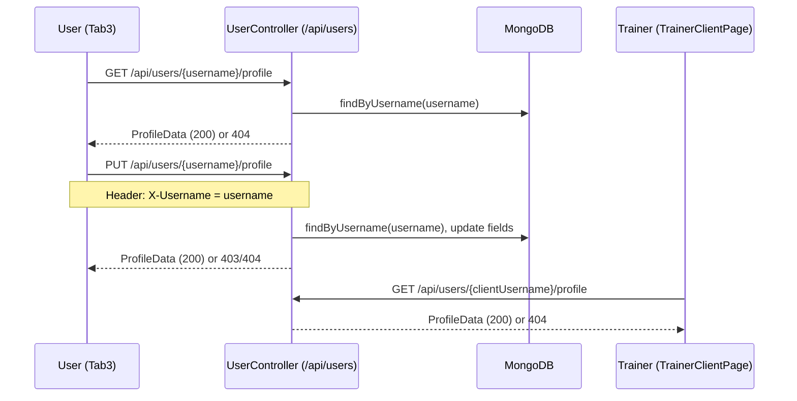

# Design Document: User Profile

## Overview

This feature adds optional personal profile fields (`displayName`, `weightKg`, `heightCm`, `profilePictureUrl`) to the existing `User` MongoDB document. Users can view and edit their own profile from Tab3 (Manage tab). Trainers can view a client's profile in read-only mode from the TrainerClientPage.

The change touches three layers:
- **Backend**: extend `User` model with profile fields, add `ProfileData` DTO, add GET/PUT endpoints under `/api/users/{username}/profile`
- **Frontend (user)**: Tab3 gains a profile section with view and edit form
- **Frontend (trainer)**: TrainerClientPage gains a read-only client profile section

---

## Architecture



---

## Components and Interfaces

### Backend

#### `User` (model — extended)
Add four nullable fields to the existing `User` document class:
- `displayName` (String)
- `weightKg` (Double)
- `heightCm` (Double)
- `profilePictureUrl` (String)

All fields default to `null`. No changes to existing constructor or registration logic (fields remain null on creation).

#### `ProfileData` (DTO)
New DTO in `com.spite.backend.dto` containing only the four profile fields. Used as both request body and response body for the profile endpoints, ensuring password and internal id are never exposed.

#### `UserController` (extended)
Two new endpoints added to the existing `UserController`:

| Method | Path | Description |
|--------|------|-------------|
| GET | `/api/users/{username}/profile` | Return ProfileData for user |
| PUT | `/api/users/{username}/profile` | Update profile fields (requires `X-Username` header) |

The PUT endpoint reads the `X-Username` request header and compares it to the `{username}` path variable. If they differ, it returns HTTP 403. If the user is not found, it returns HTTP 404.

### Frontend

#### `UserProfile` interface (models.ts)
New interface with nullable fields: `displayName`, `weightKg`, `heightCm`, `profilePictureUrl`.

#### `User` interface (models.ts — extended)
Add optional `profile?: UserProfile` field.

#### `ProfileService` (new service)
New `@Injectable({ providedIn: 'root' })` service exposing:
- `getProfile(username: string): Observable<UserProfile>`
- `updateProfile(username: string, profile: UserProfile): Observable<UserProfile>`

Both methods call the backend profile endpoints. `updateProfile` sends the `X-Username` header.

#### `Tab3Page` (extended)
- Add `userProfile: UserProfile | null` field
- Load profile via `ProfileService.getProfile()` in `loadData()`
- Add profile section to template showing display name, weight, height, and profile picture
- Add edit button that opens an inline edit form (or modal) pre-populated with current values
- On form submit, call `ProfileService.updateProfile()` and refresh displayed values
- Show loading indicator while profile is fetching

#### `TabTrainerClientPage` (extended)
- Add `clientProfile: UserProfile | null` field
- Load client profile via `ProfileService.getProfile(clientUsername)` in `ngOnInit` / `loadData()`
- Add read-only profile section to template showing display name, weight, height, and profile picture
- Show placeholder text for null fields
- Show loading indicator while profile is fetching

---

## Data Models

### Backend: `User` (extended fields)

```java
// Added to existing User document class
private String displayName;
private Double weightKg;
private Double heightCm;
private String profilePictureUrl;
// + standard getters/setters for each
```

### Backend: `ProfileData` DTO

```java
package com.spite.backend.dto;

public class ProfileData {
    private String displayName;
    private Double weightKg;
    private Double heightCm;
    private String profilePictureUrl;
    // getters + setters
}
```

### Frontend: `UserProfile` interface

```typescript
export interface UserProfile {
  displayName: string | null;
  weightKg: number | null;
  heightCm: number | null;
  profilePictureUrl: string | null;
}
```

### Frontend: `User` interface (extended)

```typescript
export interface User {
  id?: string;
  username: string;
  password: string;
  profile?: UserProfile;
}
```

---

## Correctness Properties

*A property is a characteristic or behavior that should hold true across all valid executions of a system — essentially, a formal statement about what the system should do. Properties serve as the bridge between human-readable specifications and machine-verifiable correctness guarantees.*

### Property 1: Profile round-trip persistence

*For any* valid username and any `ProfileData` object, sending a PUT request to update the profile and then a GET request to retrieve it SHALL return a `ProfileData` equal to the one that was sent.

**Validates: Requirements 3.1, 2.1**

---

### Property 2: Profile response excludes sensitive fields

*For any* GET request to `/api/users/{username}/profile`, the response body SHALL NOT contain a `password` field or an `id` field.

**Validates: Requirements 2.3**

---

### Property 3: Unauthorized update is rejected

*For any* PUT request to `/api/users/{username}/profile` where the `X-Username` header value differs from `{username}`, the endpoint SHALL return HTTP 403.

**Validates: Requirements 3.2, 3.3**

---

### Property 4: Profile for unknown user returns 404

*For any* username that does not exist in the database, both GET and PUT requests to `/api/users/{username}/profile` SHALL return HTTP 404.

**Validates: Requirements 2.2, 3.4**

---

### Property 5: Omitted fields are stored as null

*For any* PUT request that omits one or more profile fields, the stored value for each omitted field SHALL be null, and a subsequent GET SHALL reflect those null values.

**Validates: Requirements 3.5**

---

### Property 6: New user has null profile fields

*For any* user created via the registration endpoint, a subsequent GET to `/api/users/{username}/profile` SHALL return all four profile fields as null.

**Validates: Requirements 1.3**

---

### Property 7: Profile display contains all fields

*For any* `UserProfile` object, the rendered profile section in Tab3 SHALL include the display name, weight, height, and profile picture (or placeholder for each null field).

**Validates: Requirements 4.2, 5.2, 5.4**

---

## Error Handling

| Scenario | HTTP Status | Message |
|----------|-------------|---------|
| Username not found (GET profile) | 404 | "User not found" |
| Username not found (PUT profile) | 404 | "User not found" |
| X-Username header ≠ path username | 403 | "Forbidden" |
| PUT request fails (frontend) | — | Toast/alert error message shown to user |
| Profile load fails (frontend) | — | Loading indicator hidden; fields show placeholder text |

All backend error responses use `ResponseEntity<String>` consistent with the existing `UserController` pattern.

---

## Testing Strategy

### Unit / Integration Tests

Focus on specific examples and edge cases:
- GET profile for a user with all null fields returns four null values
- GET profile for a non-existent username returns 404
- PUT profile with mismatched `X-Username` header returns 403
- PUT profile with a non-existent username returns 404
- PUT profile with all fields populated, then GET returns same values
- PUT profile omitting `weightKg`, then GET returns `weightKg: null`

### Property-Based Tests

Use **jqwik** (Java) for backend property tests and **fast-check** (TypeScript) for frontend property tests. Each property test runs a minimum of 100 iterations.

Each test is tagged with a comment in the format:
`// Feature: user-profile, Property {N}: {property_text}`

| Property | Test description |
|----------|-----------------|
| P1 | For any username and ProfileData, PUT then GET returns equal ProfileData |
| P2 | For any GET /profile response, body contains no `password` or `id` field |
| P3 | For any PUT where X-Username ≠ path username, response is 403 |
| P4 | For any non-existent username, GET and PUT return 404 |
| P5 | For any PUT omitting fields, subsequent GET returns null for those fields |
| P6 | For any newly registered user, GET /profile returns all null fields |
| P7 | For any UserProfile, rendered profile section contains all four field values or placeholders |
