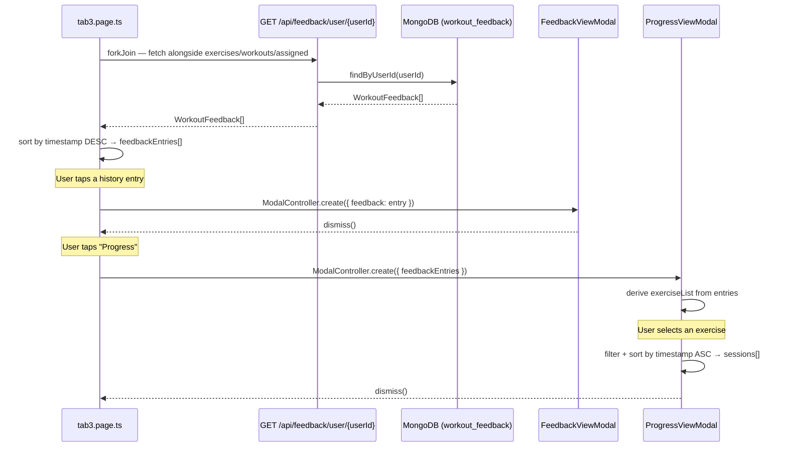

# Design Document: Workout History

## Overview

This feature adds a Workout History and Progress Tracking section to `tab3` for regular users. Feedback data already exists in MongoDB (`workout_feedback`) and is already served by `GET /api/feedback/user/{userId}`. The work is almost entirely frontend: fetch that data in `tab3`'s existing `loadData()` cycle, render a history list, reuse the existing `FeedbackViewModal` for detail view, and add a new `ProgressViewModal` for per-exercise progression.

No new backend endpoints are required. The existing `FeedbackController` already exposes everything needed.

---

## Architecture



---

## Components and Interfaces

### Frontend

#### `tab3.page.ts`
- Add `feedbackEntries: WorkoutFeedback[]` array
- Add `historyError: boolean` flag
- Extend `loadData()` `forkJoin` to include `GET /api/feedback/user/{userId}`
- Add `openFeedbackDetail(entry: WorkoutFeedback)` — opens `FeedbackViewModal`
- Add `openProgressView()` — opens `ProgressViewModal` passing `feedbackEntries`

#### `tab3.page.html`
- Add History section below "Assigned by Trainer"
- List items: `workoutTitle` + formatted date from `timestamp`
- Empty state: "No history yet"
- Error state: "Failed to load history"
- "Progress" button that calls `openProgressView()`

#### `FeedbackViewModal` (existing — minor update)
- Add `@Input() date: string` (formatted date string passed from tab3)
- Display `feedback.workoutTitle` and `date` at the top of the modal

#### `ProgressViewModal` (new)
- `@Input() feedbackEntries: WorkoutFeedback[]`
- Derives `exerciseList: { exerciseId: string, exerciseName: string }[]` — unique exercises from all entries
- `selectedExerciseId: string | null`
- `sessions: ProgressSession[]` — computed when user selects an exercise
- `selectExercise(exerciseId)` — filters and sorts sessions ascending by timestamp

---

## Data Models

No new backend models. Frontend-only additions:

```typescript
// Already exists in models.ts — no changes needed
export interface WorkoutFeedback {
  workoutId: string;
  workoutTitle?: string;
  userId: string;
  timestamp: number;
  exercises: ExerciseFeedback[];
}

export interface ExerciseFeedback {
  exerciseId: string;
  exerciseName: string;
  sets: number;
  reps: string;
  doneSets: number;
  doneReps: number;
  maxKg: number | null;
  intensity: 'easy' | 'normal' | 'hard';
}
```

New frontend-only type (local to `ProgressViewModal`):

```typescript
interface ProgressSession {
  date: string;       // formatted from timestamp
  maxKg: number | null;
  doneReps: number;
}
```

---

## Correctness Properties

*A property is a characteristic or behavior that should hold true across all valid executions of a system — essentially, a formal statement about what the system should do. Properties serve as the bridge between human-readable specifications and machine-verifiable correctness guarantees.*

### Property 1: History entries display workout title and formatted date

*For any* list of `WorkoutFeedback` entries bound to the history section, every rendered list item should contain the entry's `workoutTitle` and a non-empty date string derived from its `timestamp`.

**Validates: Requirements 1.2, 1.3**

---

### Property 2: History entries are sorted descending by timestamp

*For any* list of `WorkoutFeedback` entries with varying timestamps, the order in which they are displayed should be strictly descending by `timestamp` (most recent first).

**Validates: Requirements 1.6**

---

### Property 3: Tapping a history entry opens the modal with the correct data

*For any* `WorkoutFeedback` entry in the history list, tapping it should open `FeedbackViewModal` with that exact entry passed as the `feedback` input.

**Validates: Requirements 2.1**

---

### Property 4: FeedbackViewModal renders all required fields for every exercise

*For any* `WorkoutFeedback` with N exercises, the modal should render exactly N rows, each containing the exercise name, planned sets × reps, completed sets × reps, max kg (or "—" if null), and intensity level.

**Validates: Requirements 2.2, 2.3**

---

### Property 5: Progress grouping produces correct per-exercise session lists

*For any* list of `WorkoutFeedback` entries, grouping by `exerciseId` and sorting each group by `timestamp` ascending should produce session lists where every session belongs to the correct exercise and the timestamps are non-decreasing.

**Validates: Requirements 3.2, 3.3**

---

### Property 6: Null maxKg is displayed as "—"

*For any* `ProgressSession` where `maxKg` is `null`, the rendered value in the progress view should be the string `"—"`.

**Validates: Requirements 3.5**

---

### Property 7: Exercise list contains exactly the exercises present in feedback entries

*For any* list of `WorkoutFeedback` entries, the exercise picker in `ProgressViewModal` should display exactly the set of unique `exerciseId`/`exerciseName` pairs that appear across all entries — no more, no fewer.

**Validates: Requirements 3.6**

---

## Error Handling

| Scenario | Behavior |
|----------|----------|
| History API call fails | Set `historyError = true`; display "Failed to load history" in the section; page does not crash |
| No user in Preferences | `loadData()` returns early; `feedbackEntries` stays `[]`; History section shows "No history yet" |
| `workoutTitle` is missing/blank | Display the raw value or fall back to "Unknown workout" |
| `feedbackEntries` is empty | Show "No history yet" placeholder |

---

## Testing Strategy

### Unit Tests

- `FeedbackViewModal`: given a `WorkoutFeedback` with known exercises, assert the rendered HTML contains each exercise name and intensity pill
- `ProgressViewModal.selectExercise()`: given a fixed set of entries, assert the returned sessions are sorted ascending and contain the correct fields
- `tab3.page.ts` `loadData()`: mock HTTP to return an error for the feedback endpoint; assert `historyError` is `true` and other sections are unaffected
- `tab3.page.ts` `loadData()` with no user: assert the feedback HTTP call is never made

### Property-Based Tests

Use **fast-check** (TypeScript). Each test runs a minimum of 100 iterations.

Tag format: `// Feature: workout-history, Property {N}: {property_text}`

| Property | Test description |
|----------|-----------------|
| P1 | For any array of WorkoutFeedback, every rendered history item contains workoutTitle and a non-empty date string |
| P2 | For any array of WorkoutFeedback with varying timestamps, the displayed order is descending by timestamp |
| P3 | For any WorkoutFeedback entry, tapping it passes that exact entry to FeedbackViewModal |
| P4 | For any WorkoutFeedback with N exercises, the modal renders exactly N rows with all required fields |
| P5 | For any array of WorkoutFeedback, grouping by exerciseId and sorting ascending produces correct per-exercise session lists |
| P6 | For any ProgressSession where maxKg is null, the rendered value is "—" |
| P7 | For any array of WorkoutFeedback, the exercise picker contains exactly the unique exercises present in the entries |
