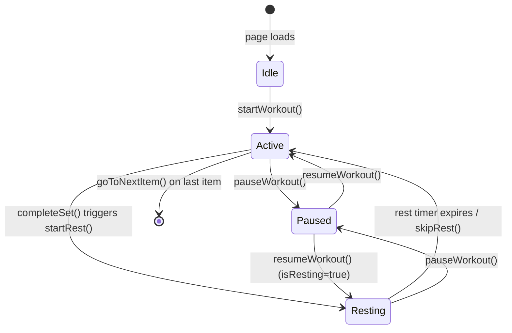

# Design Document: Workout Timer Pause

## Overview

This feature adds pause/resume capability to the active workout session in the Spite fitness app. The change is scoped entirely to the frontend: `workout.page.ts`, `workout.page.html`, and `workout.page.scss`.

The current `WorkoutPage` component manages session state through a handful of properties (`currentIndex`, `currentSet`, `isResting`, `restLeft`, etc.) and drives the rest countdown via a raw `setInterval`. There is no concept of a paused state — the timer runs until it hits zero or the user skips it.

The design introduces a single boolean flag `isPaused` that gates timer execution and button interactions. When paused during rest, the interval is cleared and `restLeft` is frozen. When paused during exercise, the session position is simply held. Resume restores the exact state in both cases.

---

## Architecture

This is a pure frontend change with no new services, routes, or backend calls. All logic lives inside `WorkoutPage`.



The state machine has two orthogonal axes:
- **Phase**: exercise phase vs. rest phase (`isResting`)
- **Running**: active vs. paused (`isPaused`)

Pause/resume operates identically regardless of phase, with the only difference being whether the `setInterval` needs to be cleared/restarted.

---

## Components and Interfaces

### WorkoutPage (modified)

New public property:

```typescript
isPaused: boolean = false;
```

New public methods:

```typescript
pauseWorkout(): void
resumeWorkout(): void
```

#### `pauseWorkout()`

1. Sets `isPaused = true`.
2. If `isResting` is true, calls `clearInterval(this.timer)` to freeze the countdown. `restLeft` is left untouched.
3. If `isResting` is false, no timer action needed — session position is already preserved in `currentIndex`, `currentSet`, `showingSuperset`.

#### `resumeWorkout()`

1. Sets `isPaused = false`.
2. If `isResting` is true, restarts the interval counting down from the current `restLeft`, using the existing `pendingRestCallback`.
3. If `isResting` is false, no further action — the user can now tap "Done" again.

### Template changes (`workout.page.html`)

- Add a Pause button inside `.card-actions`, visible when `started && !isPaused`.
- Add a Resume button inside `.card-actions`, visible when `started && isPaused`.
- Bind `[disabled]="isResting || isPaused"` on the Done button (currently only `[disabled]="isResting"`).
- Bind `[disabled]="isPaused"` on the Skip Rest button.

### Style changes (`workout.page.scss`)

- Add `.pause-btn` style consistent with the existing neon aesthetic (outline variant, warning/amber color).
- Add `.resume-btn` style (filled, primary color, matching `.start-btn` feel).

---

## Data Models

No new data models are introduced. The feature extends the existing in-memory component state.

### Extended component state

| Property | Type | Existing | Change |
|---|---|---|---|
| `isPaused` | `boolean` | No | **New** — `false` by default |
| `currentIndex` | `number` | Yes | Unchanged |
| `currentSet` | `number` | Yes | Unchanged |
| `showingSuperset` | `boolean` | Yes | Unchanged |
| `isResting` | `boolean` | Yes | Unchanged |
| `restLeft` | `number` | Yes | Frozen on pause, not reset on resume |
| `totalRest` | `number` | Yes | Unchanged |
| `timer` | `any` | Yes | Cleared on pause, restarted on resume |
| `pendingRestCallback` | `Function` | Yes | Unchanged — reused on resume |

The `isPaused` flag is the single source of truth for Pause_State. All UI bindings derive from it.

---

## Correctness Properties

*A property is a characteristic or behavior that should hold true across all valid executions of a system — essentially, a formal statement about what the system should do. Properties serve as the bridge between human-readable specifications and machine-verifiable correctness guarantees.*

### Property 1: Button visibility toggles with isPaused

*For any* started workout session, the Pause button should be visible if and only if `isPaused` is false, and the Resume button should be visible if and only if `isPaused` is true.

**Validates: Requirements 1.1, 1.2, 1.3, 1.4**

---

### Property 2: pauseWorkout() transitions to Pause_State

*For any* workout session in Active_State (started=true, isPaused=false), calling `pauseWorkout()` should result in `isPaused` being true.

**Validates: Requirements 2.1**

---

### Property 3: Session state is fully frozen while paused

*For any* workout session, after calling `pauseWorkout()`, the values of `currentIndex`, `currentSet`, `showingSuperset`, `isResting`, and `restLeft` should all remain unchanged until `resumeWorkout()` is called.

**Validates: Requirements 2.2, 3.2, 4.4, 5.3**

---

### Property 4: Interactive controls are disabled while paused

*For any* paused workout session, the Done button should be disabled; and if `isResting` is also true, the Skip Rest button should also be disabled.

**Validates: Requirements 2.3, 5.1, 5.2**

---

### Property 5: Timer stops ticking when paused

*For any* workout session where `isResting` is true, after calling `pauseWorkout()`, `restLeft` should not decrement over time (the interval is cleared).

**Validates: Requirements 3.1, 3.2**

---

### Property 6: Resume restarts countdown from preserved restLeft

*For any* paused workout session where `isResting` is true, calling `resumeWorkout()` should restart the countdown from the exact `restLeft` value that was frozen at pause time (not from `totalRest`), and the `pendingRestCallback` should fire when `restLeft` reaches zero.

**Validates: Requirements 4.2, 4.3, 4.4**

---

## Error Handling

This feature introduces no new error paths. The existing error handling (alert on load failure, alert on empty workout) is unaffected.

Edge cases to handle defensively:

- **pauseWorkout() called when already paused**: Guard with `if (this.isPaused) return;` to prevent double-clearing the timer.
- **resumeWorkout() called when not paused**: Guard with `if (!this.isPaused) return;` to prevent spurious interval creation.
- **pauseWorkout() called before workout starts**: `started` is false, so the Pause button is not rendered — no action possible. No guard needed in the method itself, but the template `*ngIf` handles this.
- **restLeft is 0 or negative at pause time**: Unlikely (the interval stops itself at 0), but `resumeWorkout()` should check `restLeft > 0` before restarting the interval; if not, call the callback directly.

---

## Testing Strategy

### Dual Testing Approach

Both unit tests and property-based tests are required. They are complementary:
- Unit tests cover specific examples, integration points, and edge cases.
- Property-based tests verify universal correctness across randomized inputs.

### Unit Tests

Focus areas:
- `pauseWorkout()` sets `isPaused = true` and clears the timer when `isResting = true`.
- `pauseWorkout()` sets `isPaused = true` and does not touch session state when `isResting = false`.
- `resumeWorkout()` sets `isPaused = false` and restarts the interval from `restLeft` when `isResting = true`.
- `resumeWorkout()` sets `isPaused = false` and does not reset `restLeft` to `totalRest`.
- `resumeWorkout()` fires `pendingRestCallback` when the restarted timer reaches zero.
- Guard: calling `pauseWorkout()` twice does not double-clear or corrupt state.
- Guard: calling `resumeWorkout()` when `restLeft = 0` calls the callback directly without starting an interval.

### Property-Based Tests

Library: **fast-check** (already available in the Angular/TypeScript ecosystem via `npm install fast-check --save-dev`).

Minimum 100 iterations per property test.

Each test is tagged with a comment in the format:
`// Feature: workout-timer-pause, Property N: <property_text>`

**Property 1 test** — Button visibility toggles with isPaused
`// Feature: workout-timer-pause, Property 1: Button visibility toggles with isPaused`
Generate arbitrary `isPaused` boolean values. Assert Pause button visible ↔ `!isPaused` and Resume button visible ↔ `isPaused`.

**Property 2 test** — pauseWorkout() transitions to Pause_State
`// Feature: workout-timer-pause, Property 2: pauseWorkout() transitions to Pause_State`
Generate arbitrary started workout states. Call `pauseWorkout()`. Assert `isPaused === true`.

**Property 3 test** — Session state is fully frozen while paused
`// Feature: workout-timer-pause, Property 3: Session state is fully frozen while paused`
Generate arbitrary session states (random `currentIndex`, `currentSet`, `showingSuperset`, `isResting`, `restLeft`). Call `pauseWorkout()`. Assert all five values are unchanged.

**Property 4 test** — Interactive controls are disabled while paused
`// Feature: workout-timer-pause, Property 4: Interactive controls are disabled while paused`
Generate arbitrary paused states with random `isResting`. Assert Done button is disabled; if `isResting=true`, also assert Skip Rest is disabled.

**Property 5 test** — Timer stops ticking when paused
`// Feature: workout-timer-pause, Property 5: Timer stops ticking when paused`
Generate arbitrary `restLeft` values > 0. Start a rest, then pause. Advance fake timers by several seconds. Assert `restLeft` has not changed.

**Property 6 test** — Resume restarts countdown from preserved restLeft
`// Feature: workout-timer-pause, Property 6: Resume restarts countdown from preserved restLeft`
Generate arbitrary `restLeft` values > 0 and a mock callback. Pause during rest. Resume. Advance fake timers by `restLeft` seconds. Assert callback was called and `restLeft` started from the preserved value (not `totalRest`).
